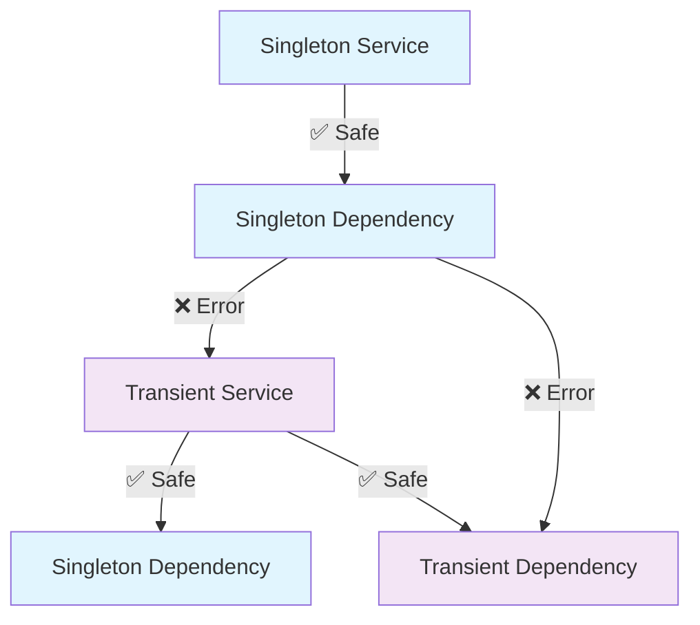

# Scopes & Lifecycles

Understanding scopes is crucial for building reliable applications with FastAPI Service. Scopes control when and how instances of your services are created and reused.

## Available Scopes

### SINGLETON Scope

A singleton service has **one instance per application lifetime**. The same instance is reused across all requests.

```python
from fastapi_service import injectable, Scopes

@injectable(scope=Scopes.SINGLETON)
class ConfigService:
    def __init__(self):
        # This runs once at application startup
        self.config = self._load_config_from_file()
        print("ConfigService initialized")
    
    def get(self, key: str):
        return self.config.get(key)
```

**Use cases for SINGLETON:**
- Configuration services
- Connection pools
- Cache services
- Machine learning models (expensive to load)
- Read-only data that doesn't change

**Characteristics:**
- ✅ Memory efficient (one instance)
- ✅ Fast (no repeated instantiation)
- ⚠️ Shared state across requests
- ⚠️ Must be thread-safe

### TRANSIENT Scope

A transient service creates a **new instance for each request**. This is the default behavior.

```python
from fastapi_service import injectable  # TRANSIENT is default

@injectable  # or @injectable(scope=Scopes.TRANSIENT)
class DatabaseSession:
    def __init__(self):
        # This runs for every request
        self.connection = self._create_connection()
        print("DatabaseSession initialized")
    
    def query(self, sql: str):
        return self.connection.execute(sql)
    
    def __del__(self):
        # Clean up when instance is destroyed
        if hasattr(self, 'connection'):
            self.connection.close()
```

**Use cases for TRANSIENT:**
- Database sessions
- Request-scoped data
- User-specific information
- Temporary calculations
- Non-thread-safe operations

**Characteristics:**
- ✅ Isolated state per request
- ✅ No thread-safety concerns
- ⚠️ More memory usage
- ⚠️ Slower (repeated instantiation)

## Scope Safety

FastAPI Service prevents dangerous scope combinations that could lead to memory leaks or inconsistent state.

### Invalid: Transient → Singleton

```python
# ❌ This will raise ValueError
@injectable(scope=Scopes.SINGLETON)
class GlobalCache:
    def __init__(self, session: DatabaseSession):  # DatabaseSession is TRANSIENT
        self.session = session  # Would trap session forever!
```

**Why this is dangerous:**
- The singleton would hold a reference to a transient service
- The transient service would never be garbage collected
- Memory leak across requests

### Valid: Singleton → Transient

```python
# ✅ This is perfectly fine
@injectable(scope=Scopes.SINGLETON)
class ConfigService:
    def __init__(self):
        self.config = self._load_config()

@injectable  # TRANSIENT by default
class DatabaseSession:
    def __init__(self, config: ConfigService):  # ConfigService is SINGLETON
        self.config = config  # Safe: singleton can be injected into transient
```

### Valid: Transient → Transient

```python
# ✅ This is also fine
@injectable  # TRANSIENT
class AuditService:
    def __init__(self):
        self.events = []

@injectable  # TRANSIENT
class UserService:
    def __init__(self, audit: AuditService):  # Both are TRANSIENT
        self.audit = audit  # Safe: same scope
```

## Scope Resolution Rules

The system enforces these rules:

1. **Singleton can depend on:** Singleton only
2. **Transient can depend on:** Singleton or Transient
3. **Mixed scopes:** Always allowed in the direction that prevents leaks



## Practical Examples

### Configuration Management (Singleton)

```python
@injectable(scope=Scopes.SINGLETON)
class AppConfig:
    def __init__(self):
        # Load configuration once
        self._config = {
            "database_url": os.getenv("DATABASE_URL"),
            "api_key": os.getenv("API_KEY"),
            "debug": os.getenv("DEBUG", "false").lower() == "true",
            "max_connections": int(os.getenv("MAX_CONNECTIONS", "10"))
        }
    
    def get(self, key: str, default=None):
        return self._config.get(key, default)
```

### Database Session (Transient)

```python
@injectable  # TRANSIENT by default
class DatabaseSession:
    def __init__(self, config: AppConfig):
        self.config = config
        self.connection = None
        self._connect()
    
    def _connect(self):
        # Create new connection for each request
        self.connection = psycopg2.connect(self.config.get("database_url"))
    
    def execute(self, query: str, params=None):
        with self.connection.cursor() as cursor:
            cursor.execute(query, params)
            return cursor.fetchall()
    
    def __del__(self):
        # Clean up connection when instance is destroyed
        if self.connection:
            self.connection.close()
```

### Cache Service (Singleton)

```python
@injectable(scope=Scopes.SINGLETON)
class CacheService:
    def __init__(self, config: AppConfig):
        self.redis = redis.Redis(
            host=config.get("redis_host", "localhost"),
            port=config.get("redis_port", 6379),
            decode_responses=True
        )
    
    def get(self, key: str):
        return self.redis.get(key)
    
    def set(self, key: str, value: str, ttl: int = 3600):
        self.redis.setex(key, ttl, value)
```

### User Service (Transient)

```python
@injectable  # TRANSIENT
class UserService:
    def __init__(self, db: DatabaseSession, cache: CacheService):
        self.db = db  # TRANSIENT - new session per request
        self.cache = cache  # SINGLETON - shared cache
    
    def get_user(self, user_id: int):
        # Check cache first (singleton)
        cached = self.cache.get(f"user:{user_id}")
        if cached:
            return json.loads(cached)
        
        # Query database (transient session)
        result = self.db.execute(
            "SELECT * FROM users WHERE id = %s",
            (user_id,)
        )
        
        if result:
            user = result[0]
            # Cache for future requests
            self.cache.set(f"user:{user_id}", json.dumps(user))
            return user
        
        return None
```

## Performance Considerations

### Memory Usage

```python
# Memory comparison for 1000 requests

# SINGLETON: 1 instance total
@injectable(scope=Scopes.SINGLETON)
class HeavyService:
    def __init__(self):
        self.data = self._load_large_dataset()  # 10MB
# Total memory: 10MB

# TRANSIENT: 1000 instances (worst case)
@injectable
class HeavyService:
    def __init__(self):
        self.data = self._load_large_dataset()  # 10MB each
# Total memory: 10GB (dangerous!)
```

### Initialization Time

```python
# Startup time comparison

@injectable(scope=Scopes.SINGLETON)
class ExpensiveService:
    def __init__(self):
        self.model = self._load_ml_model()  # 5 seconds
# Startup impact: 5 seconds (once)

@injectable
class ExpensiveService:
    def __init__(self):
        self.model = self._load_ml_model()  # 5 seconds each
# Request impact: 5 seconds (every request - terrible!)
```

## Best Practices

### ✅ DO: Use Singleton for Expensive Resources

```python
@injectable(scope=Scopes.SINGLETON)
class MLModelService:
    def __init__(self):
        # Load once, reuse many times
        self.model = self._load_large_model()
        self.tokenizer = self._load_tokenizer()
```

### ✅ DO: Use Transient for Request Data

```python
@injectable  # TRANSIENT
class RequestContext:
    def __init__(self):
        # Fresh data for each request
        self.start_time = time.time()
        self.request_id = str(uuid.uuid4())
        self.user_agent = None
```

### ❌ DON'T: Make Everything Singleton

```python
# ❌ Bad: All singletons can cause memory leaks
@injectable(scope=Scopes.SINGLETON)
class UserDataService:
    def __init__(self):
        self.user_cache = {}  # Grows forever!
```

### ❌ DON'T: Make Everything Transient

```python
# ❌ Bad: Expensive operations repeated
@injectable  # TRANSIENT
class DatabaseConnection:
    def __init__(self):
        self.connection = self._establish_connection()  # Expensive!
```

## Scope Validation

The system validates scopes at runtime and provides helpful error messages:

```python
# This will fail with a clear error message
@injectable(scope=Scopes.SINGLETON)
class BadService:
    def __init__(self, session: DatabaseSession):  # DatabaseSession is TRANSIENT
        pass

# Error: Cannot inject non-singleton-scoped dependency 'DatabaseSession' 
# into singleton 'BadService'. This would create a memory leak.
# 
# Solutions:
# 1. Change BadService to TRANSIENT scope
# 2. Change DatabaseSession to SINGLETON scope  
# 3. Don't store the session as an instance variable
```

## Testing with Scopes

### Test Isolation with Transients

```python
def test_user_isolation():
    # Each test gets fresh instances
    user_service_1 = container.resolve(UserService)
    user_service_2 = container.resolve(UserService)
    
    # They don't interfere
    user_service_1.set_current_user(user_1)
    user_service_2.set_current_user(user_2)
    
    assert user_service_1.get_current_user() != user_service_2.get_current_user()
```

### Mocking Singletons

```python
def test_with_mock_config():
    # Replace singleton for testing
    original_config = container._registry.get(ConfigService)
    
    class MockConfig:
        def get(self, key):
            return "test-value"
    
    container._registry[ConfigService] = MockConfig()
    
    # Run test with mock
    result = some_service.do_something()
    
    # Restore original
    if original_config:
        container._registry[ConfigService] = original_config
```

## Migration Patterns

### From Manual DI to Scoped DI

```python
# Before: Manual management
def create_app():
    config = ConfigService()  # Always singleton
    cache = CacheService(config)  # Should be singleton
    db_factory = lambda: DatabaseSession(config)  # Must be transient
    
    app = FastAPI()
    app.state.config = config
    app.state.cache = cache
    
    return app

# After: Automatic scoping
@injectable(scope=Scopes.SINGLETON)
class ConfigService: pass

@injectable(scope=Scopes.SINGLETON)
class CacheService: pass

@injectable  # TRANSIENT
class DatabaseSession: pass

# System handles scoping automatically
```

## Summary

Choosing the right scope is essential for:

- **Performance**: Singleton for expensive resources
- **Memory**: Transient for request-scoped data
- **Safety**: System prevents dangerous combinations
- **Testing**: Proper isolation and mocking

Remember: When in doubt, start with **TRANSIENT** and optimize to **SINGLETON** when you have clear performance requirements.